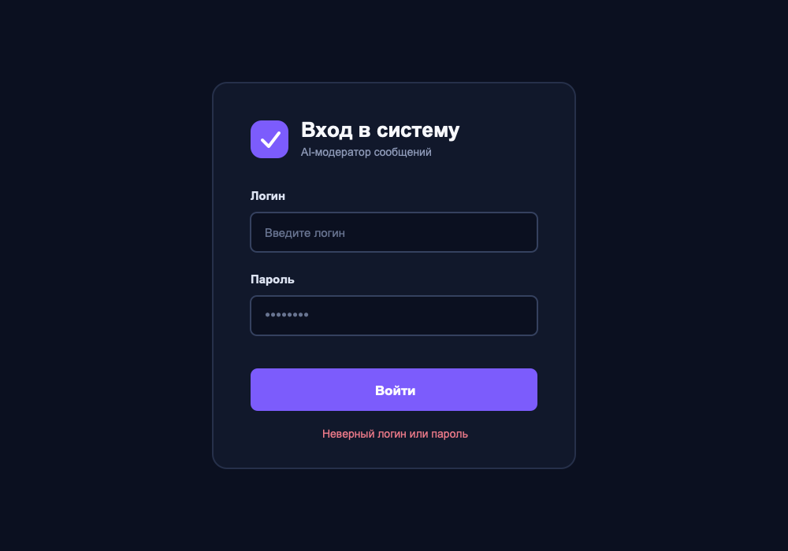
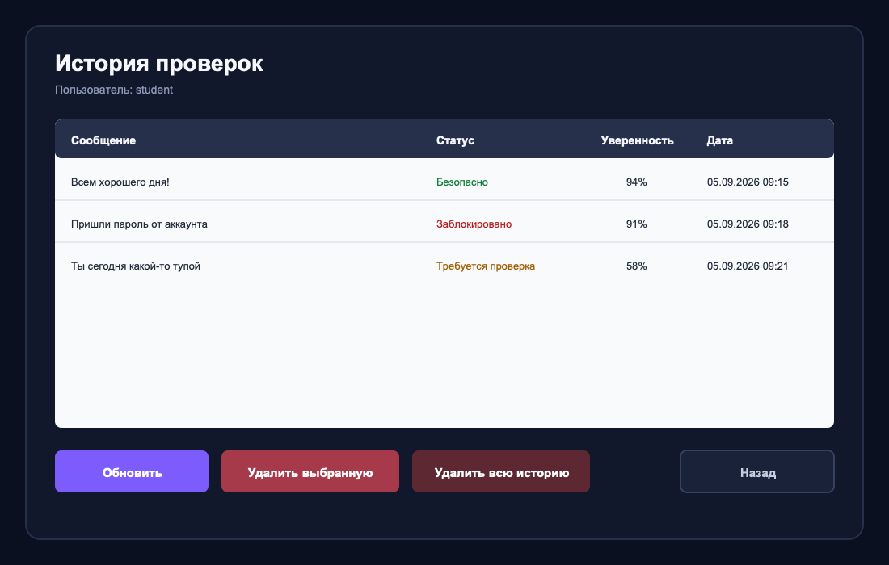

# Практическая работа: авторизация и история AI-модератора в MySQL

Это продолжение практической работы [AI-модератор сообщений на Windows Forms](https://github.com/pgk-lectures/winforms-ai-moderator).

Готовый AI-модератор изменять с нуля не нужно. Мы добавим к нему:

- авторизацию по логину и паролю;
- базу данных MySQL;
- сохранение каждой выполненной проверки;
- отдельную форму с DataGridView;
- удаление выбранной записи;
- удаление всей истории текущего пользователя.

Интерфейс по-прежнему создаётся мышкой через Visual Studio Designer. Вручную пишется только логика C# и SQL.

## Что получится

### Форма входа

### История проверок

## Как будет работать приложение

~~~text
Запуск приложения
        ↓
Ввод логина и пароля
        ↓
Поиск пользователя в MySQL
        ↓
Открытие AI-модератора
        ↓
Проверка и сохранение сообщения
        ↓
Просмотр истории в DataGridView
        ↓
Удаление одной записи или всей истории
~~~

Пользователь видит только собственную историю.

Пустое сообщение не сохраняется, потому что оно не прошло модерацию.

---

# Часть 1. Создание базы в MySQL Workbench

## MySQL Server и MySQL Workbench

Это две разные программы:

- **MySQL Server** хранит базы данных и выполняет SQL-запросы;
- **MySQL Workbench** показывает базы и позволяет отправлять команды серверу.

Workbench без запущенного MySQL Server не сможет подключиться.

## Шаг 1. Создайте схему

Откройте MySQL Workbench и существующее локальное подключение.

1. Найдите слева панель **Navigator**.
2. Откройте вкладку **Schemas**.
3. Щёлкните правой кнопкой по свободному месту внутри списка.
4. Выберите **Create Schema**.
5. Заполните:

| Свойство | Значение | Для чего нужно |
| --- | --- | --- |
| Name | ai_moderator | Название базы данных |
| Charset | utf8mb4 | Позволяет хранить русский текст |
| Collation | utf8mb4_unicode_ci | Задаёт правила сравнения текста |

6. Нажмите **Apply**.
7. Workbench покажет автоматически созданную команду. Самостоятельно писать её не нужно.
8. Ещё раз нажмите **Apply**.
9. Нажмите **Finish**.

В списке Schemas должна появиться схема ai_moderator.

## Шаг 2. Создайте таблицу users

1. Раскройте схему ai_moderator.
2. Щёлкните правой кнопкой по папке **Tables**.
3. Выберите **Create Table**.
4. В поле **Table Name** напишите users.
5. Добавьте три строки в таблицу Columns:

| Column Name | Datatype | Флажки | Для чего нужно |
| --- | --- | --- | --- |
| id | INT | PK, NN, AI | Уникальный номер пользователя |
| login | VARCHAR(50) | NN, UQ | Логин, который не должен повторяться |
| password | VARCHAR(100) | NN | Обычный текст пароля |

Обозначения:

- PK — основной ключ таблицы;
- NN — значение обязательно;
- UQ — значение не должно повторяться;
- AI — MySQL сам увеличивает число.

6. Нажмите **Apply**.
7. В окне подтверждения нажмите **Apply**.
8. Нажмите **Finish**.

В этой учебной локальной работе пароль хранится обычным текстом. В настоящем приложении так делать нельзя: пароль должен храниться в виде безопасного хеша.

## Шаг 3. Создайте таблицу moderation_history

1. Снова щёлкните правой кнопкой по папке Tables.
2. Выберите **Create Table**.
3. В Table Name напишите moderation_history.
4. Добавьте столбцы:

| Column Name | Datatype | Флажки | Default | Для чего нужно |
| --- | --- | --- | --- | --- |
| id | INT | PK, NN, AI | оставить пустым | Номер записи |
| user_id | INT | NN | оставить пустым | Пользователь, выполнивший проверку |
| message | TEXT | NN | оставить пустым | Проверенное сообщение |
| status | VARCHAR(50) | NN | оставить пустым | Результат модерации |
| confidence | INT | NN | оставить пустым | Процент уверенности |
| created_at | DATETIME | NN | CURRENT_TIMESTAMP | Дата и время проверки |

Пока не нажимайте Apply. Сначала создадим связь с users.

## Шаг 4. Свяжите таблицы

1. В нижней части редактора moderation_history откройте вкладку **Foreign Keys**.
2. Нажмите пустую строку в списке Foreign Key Name.
3. Введите название:

~~~text
fk_history_user
~~~

4. В поле **Referenced Table** выберите:

~~~text
ai_moderator.users
~~~

5. В таблице Columns установите:

| Column | Referenced Column | Для чего нужно |
| --- | --- | --- |
| user_id | id | Связывает запись истории с пользователем |

6. Для **On Delete** выберите CASCADE.
7. Для **On Update** оставьте RESTRICT.
8. Нажмите **Apply**.
9. В окне подтверждения снова нажмите **Apply**.
10. Нажмите **Finish**.

CASCADE означает: если пользователь будет удалён, MySQL автоматически удалит связанную с ним историю.

## Шаг 5. Добавьте пользователя student

1. В Schemas раскройте ai_moderator → Tables.
2. Щёлкните правой кнопкой по users.
3. Выберите **Select Rows — Limit 1000**.
4. Внизу таблицы найдите пустую строку со значениями NULL.
5. Поле id не заполняйте.
6. В поле login напишите student.
7. В поле password напишите 1234.
8. Нажмите **Apply**.
9. Workbench покажет автоматически подготовленное изменение.
10. Нажмите **Apply**, затем **Finish**.

Данные для входа:

~~~text
Логин: student
Пароль: 1234
~~~

## Шаг 6. Проверьте результат

1. Вернитесь во вкладку Schemas.
2. Нажмите кнопку обновления.
3. Раскройте ai_moderator → Tables.
4. Убедитесь, что видны users и moderation_history.
5. Откройте users через **Select Rows — Limit 1000**.
6. Убедитесь, что в таблице есть student с паролем 1234.
7. Откройте moderation_history тем же способом.

История пока должна быть пустой. Записи появятся после запуска приложения.

---

# Часть 2. Подключение MySQL к Visual Studio

## Шаг 7. Откройте проект

1. Запустите Visual Studio.
2. Откройте готовое решение **AiModerator**.
3. Нажмите F5 и убедитесь, что прежняя программа работает.
4. Закройте запущенное приложение.

## Шаг 8. Установите MySql.Data

1. В Solution Explorer нажмите правой кнопкой по проекту **AiModerator**.
2. Выберите **Manage NuGet Packages**.
3. Откройте вкладку **Browse**.
4. Введите в поиске:

~~~text
MySql.Data
~~~

5. Выберите пакет **MySql.Data** от Oracle.
6. Нажмите **Install**.
7. Подтвердите установку и лицензию.

После установки в разделе Dependencies → Packages появится MySql.Data.

Этот пакет содержит классы MySqlConnection, MySqlCommand и MySqlDataAdapter.

---

# Часть 3. Текущий пользователь

## Шаг 9. Создайте Session.cs

1. Нажмите правой кнопкой по проекту AiModerator.
2. Выберите **Add → Class**.
3. Введите имя:

~~~text
Session.cs
~~~

4. Нажмите **Add**.
5. Замените содержимое файла:

~~~csharp
namespace AiModerator
{
    // Хранит пользователя, который вошёл в приложение.
    public static class Session
    {
        // Значение 0 означает, что вход ещё не выполнен.
        public static int UserId { get; set; }

        // Логин понадобится для отображения на формах.
        public static string Login { get; set; } = "";
    }
}
~~~

Static позволяет обращаться к данным из любой формы:

~~~csharp
Session.UserId
Session.Login
~~~

---

# Часть 4. Класс Database

## Шаг 10. Создайте Database.cs

1. Нажмите правой кнопкой по проекту.
2. Выберите **Add → Class**.
3. Назовите файл **Database.cs**.
4. Добавьте в начало:

~~~csharp
using MySql.Data.MySqlClient;
using System;
using System.Data;
~~~

5. Создайте класс:

~~~csharp
namespace AiModerator
{
    // Все SQL-запросы приложения находятся в одном классе.
    public static class Database
    {
    }
}
~~~

Следующие методы добавляйте внутрь класса Database.

## Шаг 11. Добавьте строку подключения

Внутри Database добавьте:

~~~csharp
// Используем те же данные MySQL, с которыми подключаемся через Workbench.
private const string ConnectionString =
    "Server=АДРЕС_СЕРВЕРА;Port=ПОРТ;Database=ai_moderator;" +
    "Uid=ЛОГИН_MYSQL;Pwd=ПАРОЛЬ_MYSQL;" +
    "SslMode=None;AllowPublicKeyRetrieval=True;";
~~~

Перепишите в строку подключения данные, которые преподаватель выдал для подключения через Workbench:

| Данные в Workbench | Параметр в C# | Для чего нужен |
| --- | --- | --- |
| Hostname | Server | Адрес MySQL-сервера |
| Port | Port | Порт MySQL-сервера |
| Username | Uid | Логин для подключения к MySQL |
| Password | Pwd | Пароль для подключения к MySQL |
| — | Database | Схема ai_moderator, созданная в первой части |
| — | SslMode | Для учебного подключения отключает SSL |
| — | AllowPublicKeyRetrieval | Разрешает авторизацию MySQL 8 |

Не перепутайте два разных входа:

- данные от преподавателя подключают Workbench и программу C# к MySQL-серверу;
- student и пароль 1234 нужны для входа в окно учебного приложения. Они хранятся в таблице users.

## Шаг 12. Добавьте авторизацию

Внутрь Database добавьте:

~~~csharp
public static int Authenticate(string login, string password)
{
    // using автоматически закрывает подключение после метода.
    using MySqlConnection connection =
        new MySqlConnection(ConnectionString);

    connection.Open();

    // Параметры защищают запрос от SQL-инъекций.
    string sql =
        "SELECT id FROM users " +
        "WHERE login = @login " +
        "AND password = @password " +
        "LIMIT 1;";

    using MySqlCommand command =
        new MySqlCommand(sql, connection);

    command.Parameters.AddWithValue("@login", login);
    command.Parameters.AddWithValue("@password", password);

    // ExecuteScalar возвращает первое значение первой строки.
    object? result = command.ExecuteScalar();

    if (result == null)
    {
        return 0;
    }

    return Convert.ToInt32(result);
}
~~~

Метод возвращает id пользователя. Если логин или пароль неверные, возвращается 0.

## Шаг 13. Добавьте сохранение истории

Добавьте в Database:

~~~csharp
public static void AddHistory(
    string message,
    string status,
    int confidence)
{
    using MySqlConnection connection =
        new MySqlConnection(ConnectionString);

    connection.Open();

    string sql =
        "INSERT INTO moderation_history " +
        "(user_id, message, status, confidence) " +
        "VALUES (@userId, @message, @status, @confidence);";

    using MySqlCommand command =
        new MySqlCommand(sql, connection);

    command.Parameters.AddWithValue("@userId", Session.UserId);
    command.Parameters.AddWithValue("@message", message);
    command.Parameters.AddWithValue("@status", status);
    command.Parameters.AddWithValue("@confidence", confidence);

    // ExecuteNonQuery выполняет INSERT, UPDATE или DELETE.
    command.ExecuteNonQuery();
}
~~~

Дата не передаётся: MySQL заполнит created_at автоматически.

## Шаг 14. Добавьте загрузку истории

Добавьте:

~~~csharp
public static DataTable GetHistory()
{
    using MySqlConnection connection =
        new MySqlConnection(ConnectionString);

    connection.Open();

    string sql =
        "SELECT id, message, status, confidence, created_at " +
        "FROM moderation_history " +
        "WHERE user_id = @userId " +
        "ORDER BY created_at DESC;";

    using MySqlCommand command =
        new MySqlCommand(sql, connection);

    command.Parameters.AddWithValue("@userId", Session.UserId);

    // DataTable удобно передать в DataGridView.
    DataTable table = new DataTable();

    using MySqlDataAdapter adapter =
        new MySqlDataAdapter(command);

    adapter.Fill(table);
    return table;
}
~~~

WHERE user_id не позволяет одному пользователю увидеть чужую историю.

ORDER BY created_at DESC показывает новые записи сверху.

## Шаг 15. Добавьте удаление одной записи

Добавьте:

~~~csharp
public static void DeleteHistory(int historyId)
{
    using MySqlConnection connection =
        new MySqlConnection(ConnectionString);

    connection.Open();

    string sql =
        "DELETE FROM moderation_history " +
        "WHERE id = @historyId AND user_id = @userId;";

    using MySqlCommand command =
        new MySqlCommand(sql, connection);

    command.Parameters.AddWithValue("@historyId", historyId);
    command.Parameters.AddWithValue("@userId", Session.UserId);
    command.ExecuteNonQuery();
}
~~~

Проверка user_id нужна, чтобы пользователь удалял только собственную запись.

## Шаг 16. Добавьте удаление всей истории

Добавьте:

~~~csharp
public static void DeleteAllHistory()
{
    using MySqlConnection connection =
        new MySqlConnection(ConnectionString);

    connection.Open();

    string sql =
        "DELETE FROM moderation_history " +
        "WHERE user_id = @userId;";

    using MySqlCommand command =
        new MySqlCommand(sql, connection);

    command.Parameters.AddWithValue("@userId", Session.UserId);
    command.ExecuteNonQuery();
}
~~~

Метод удаляет все записи только текущего пользователя.

---

# Часть 5. Форма авторизации

## Шаг 17. Добавьте новую форму

1. Нажмите правой кнопкой по проекту AiModerator.
2. Выберите **Add → Windows Form**.
3. Введите имя:

~~~text
LoginForm.cs
~~~

4. Нажмите **Add**.

Откроется конструктор новой формы.

## Шаг 18. Настройте LoginForm

Щёлкните по свободному месту формы и задайте:

| Свойство | Значение | Для чего нужно |
| --- | --- | --- |
| (Name) | LoginForm | Имя формы в C# |
| Text | Вход — AI-модератор | Заголовок окна |
| ClientSize | 520, 560 | Размер рабочей области |
| StartPosition | CenterScreen | Открывает окно по центру |
| BackColor | 11, 16, 32 | Тёмный фон |
| FormBorderStyle | FixedSingle | Запрещает менять размер |
| MaximizeBox | False | Убирает кнопку разворачивания |
| Font | Segoe UI, 10pt | Основной шрифт |

## Шаг 19. Добавьте панель авторизации

Добавьте Panel:

| Свойство | Значение | Для чего нужно |
| --- | --- | --- |
| (Name) | pnlLogin | Имя основной панели |
| Location | 40, 40 | Отступ от краёв формы |
| Size | 440, 480 | Размер области входа |
| BackColor | 17, 24, 43 | Цвет рабочей области |

Следующие элементы помещайте внутрь pnlLogin.

## Шаг 20. Добавьте шапку

Добавьте PictureBox:

| Свойство | Значение | Для чего нужно |
| --- | --- | --- |
| (Name) | picLogo | Имя картинки |
| Location | 48, 42 | Расположение логотипа |
| Size | 48, 48 | Размер логотипа |
| Image | logo | Ресурс из первой работы |
| SizeMode | Zoom | Вписывает изображение |

Добавьте Label:

| Свойство | Значение | Для чего нужно |
| --- | --- | --- |
| (Name) | lblTitle | Имя заголовка |
| Text | Вход в систему | Название формы |
| Location | 112, 42 | Расположение справа от логотипа |
| AutoSize | True | Подбирает размер под текст |
| Font | Segoe UI, 19pt, Bold | Выделяет название |
| ForeColor | 247, 248, 252 | Светлый текст |
| BackColor | Transparent | Показывает фон панели |

Добавьте второй Label:

| Свойство | Значение | Для чего нужно |
| --- | --- | --- |
| (Name) | lblSubtitle | Имя подзаголовка |
| Text | AI-модератор сообщений | Поясняет назначение входа |
| Location | 112, 78 | Расположение под названием |
| AutoSize | True | Подбирает размер |
| Font | Segoe UI, 10pt | Размер подзаголовка |
| ForeColor | 142, 154, 184 | Приглушённый цвет |

## Шаг 21. Добавьте поле логина

Сначала добавьте Label:

| Свойство | Значение | Для чего нужно |
| --- | --- | --- |
| (Name) | lblLogin | Имя подписи |
| Text | Логин | Текст над полем |
| Location | 48, 142 | Расположение подписи |
| AutoSize | True | Подбирает размер |
| Font | Segoe UI, 11pt, Bold | Выделяет подпись |
| ForeColor | 221, 227, 242 | Светлый текст |

Под ним добавьте TextBox:

| Свойство | Значение | Для чего нужно |
| --- | --- | --- |
| (Name) | txtLogin | Имя поля, которое использует код |
| Location | 48, 168 | Расположение поля |
| Size | 344, 34 | Размер поля |
| Font | Segoe UI, 12pt | Размер вводимого текста |
| BackColor | 11, 16, 32 | Тёмный фон |
| ForeColor | 221, 227, 242 | Светлый текст |
| MaxLength | 50 | Ограничивает длину логина |

## Шаг 22. Добавьте поле пароля

Добавьте Label:

| Свойство | Значение | Для чего нужно |
| --- | --- | --- |
| (Name) | lblPassword | Имя подписи |
| Text | Пароль | Текст над полем |
| Location | 48, 230 | Расположение подписи |
| AutoSize | True | Подбирает размер |
| Font | Segoe UI, 11pt, Bold | Выделяет подпись |
| ForeColor | 221, 227, 242 | Светлый текст |

Добавьте TextBox:

| Свойство | Значение | Для чего нужно |
| --- | --- | --- |
| (Name) | txtPassword | Имя поля пароля |
| Location | 48, 256 | Расположение поля |
| Size | 344, 34 | Размер поля |
| Font | Segoe UI, 12pt | Размер текста |
| BackColor | 11, 16, 32 | Тёмный фон |
| ForeColor | 221, 227, 242 | Светлый текст |
| MaxLength | 50 | Ограничивает длину |
| UseSystemPasswordChar | True | Скрывает введённые символы |

## Шаг 23. Добавьте кнопку входа

Добавьте Button:

| Свойство | Значение | Для чего нужно |
| --- | --- | --- |
| (Name) | btnLogin | Имя кнопки для Click |
| Text | Войти | Текст на кнопке |
| Location | 48, 326 | Расположение кнопки |
| Size | 344, 52 | Размер кнопки |
| BackColor | 124, 92, 252 | Фиолетовый фон |
| ForeColor | White | Белый текст |
| Font | Segoe UI, 12pt, Bold | Выделяет надпись |
| FlatStyle | Flat | Плоский стиль |
| Cursor | Hand | Курсор-рука |

В FlatAppearance установите BorderSize = 0.

После добавления кнопки снова выделите LoginForm и установите:

| Свойство | Значение | Для чего нужно |
| --- | --- | --- |
| AcceptButton | btnLogin | Позволяет войти клавишей Enter |

## Шаг 24. Добавьте сообщение об ошибке

Добавьте Label:

| Свойство | Значение | Для чего нужно |
| --- | --- | --- |
| (Name) | lblError | Имя сообщения, которым управляет код |
| Text | Неверный логин или пароль | Текст ошибки |
| Location | 48, 400 | Расположение под кнопкой |
| Size | 344, 24 | Область сообщения |
| AutoSize | False | Сохраняет заданный размер |
| TextAlign | MiddleCenter | Выравнивает текст по центру |
| ForeColor | 239, 123, 138 | Красный цвет |
| Visible | False | Скрывает ошибку до неудачного входа |

## Шаг 25. Напишите обработчик входа

Откройте LoginForm.cs клавишей F7.

Добавьте в начало:

~~~csharp
using MySql.Data.MySqlClient;
~~~

Внутри класса LoginForm добавьте:

~~~csharp
private void btnLogin_Click(object sender, EventArgs e)
{
    // Убираем старую ошибку перед новой попыткой.
    lblError.Visible = false;

    string login = txtLogin.Text.Trim();
    string password = txtPassword.Text;

    // Проверяем, что оба поля заполнены.
    if (string.IsNullOrWhiteSpace(login) ||
        string.IsNullOrWhiteSpace(password))
    {
        lblError.Text = "Введите логин и пароль";
        lblError.Visible = true;
        return;
    }

    btnLogin.Enabled = false;

    try
    {
        // Database вернёт id пользователя или 0.
        int userId = Database.Authenticate(login, password);

        if (userId == 0)
        {
            lblError.Text = "Неверный логин или пароль";
            lblError.Visible = true;
            return;
        }

        // Сохраняем вошедшего пользователя.
        Session.UserId = userId;
        Session.Login = login;

        // Прячем вход и открываем модератор.
        Hide();

        using Form1 moderatorForm = new Form1();
        moderatorForm.ShowDialog();

        Close();
    }
    catch (MySqlException)
    {
        MessageBox.Show(
            "Не удалось подключиться к базе данных.",
            "Ошибка MySQL",
            MessageBoxButtons.OK,
            MessageBoxIcon.Error);
    }
    finally
    {
        // Кнопка включится даже после ошибки.
        btnLogin.Enabled = true;
    }
}
~~~

## Шаг 26. Подключите событие

1. Вернитесь в Designer клавишами Shift + F7.
2. Выделите btnLogin.
3. Нажмите F4.
4. Откройте вкладку Events значком молнии.
5. Для Click выберите btnLogin_Click.

---

# Часть 6. Запуск с формы входа

## Шаг 27. Измените Program.cs

1. В Solution Explorer откройте Program.cs.
2. Найдите строку:

~~~csharp
Application.Run(new Form1());
~~~

3. Замените её:

~~~csharp
// Сначала запускаем авторизацию.
Application.Run(new LoginForm());
~~~

Теперь первой откроется LoginForm.

Нажмите Ctrl + Shift + B. Проект должен собраться без ошибок.

---

# Часть 7. Изменение формы модератора

## Шаг 28. Покажите текущего пользователя

Откройте Form1 в Designer.

Добавьте Label внутрь pnlMain:

| Свойство | Значение | Для чего нужно |
| --- | --- | --- |
| (Name) | lblCurrentUser | Имя надписи для C# |
| Text | Пользователь: student | Пример текста |
| Location | 650, 50 | Расположение справа в шапке |
| Size | 250, 24 | Место для логина |
| AutoSize | False | Сохраняет размер |
| TextAlign | MiddleRight | Прижимает текст вправо |
| ForeColor | 142, 154, 184 | Приглушённый цвет |
| BackColor | Transparent | Показывает фон панели |

В конструкторе Form1 после InitializeComponent добавьте:

~~~csharp
// Показываем логин пользователя, который вошёл.
lblCurrentUser.Text = "Пользователь: " + Session.Login;
~~~

## Шаг 29. Добавьте кнопку истории

Добавьте Button внутрь pnlMain:

| Свойство | Значение | Для чего нужно |
| --- | --- | --- |
| (Name) | btnHistory | Имя кнопки для Click |
| Text | История | Текст на кнопке |
| Location | 448, 366 | Расположение рядом с «Очистить» |
| Size | 150, 54 | Размер кнопки |
| BackColor | 25, 34, 56 | Тёмный фон |
| ForeColor | 198, 206, 224 | Светлый текст |
| Font | Segoe UI, 12pt, Bold | Размер надписи |
| FlatStyle | Flat | Плоский стиль |
| Cursor | Hand | Курсор-рука |

В FlatAppearance:

| Свойство | Значение | Для чего нужно |
| --- | --- | --- |
| BorderSize | 1 | Тонкая рамка |
| BorderColor | 53, 65, 95 | Цвет рамки |

## Шаг 30. Подготовьте процент до отображения

В старом коде Random вызывается внутри ShowSafeResult, ShowBlockedResult и ShowReviewResult.

Теперь процент нужен ещё и для записи в MySQL. Поэтому добавьте:

~~~csharp
private int GetConfidence(ModerationStatus status)
{
    // Для каждого статуса используется свой диапазон.
    switch (status)
    {
        case ModerationStatus.Safe:
            return random.Next(80, 101);

        case ModerationStatus.Blocked:
            return random.Next(85, 101);

        default:
            return random.Next(40, 80);
    }
}
~~~

Добавьте преобразование статуса в русский текст:

~~~csharp
private string GetStatusText(ModerationStatus status)
{
    switch (status)
    {
        case ModerationStatus.Safe:
            return "Сообщение безопасно";

        case ModerationStatus.Blocked:
            return "Сообщение заблокировано";

        default:
            return "Требуется проверка";
    }
}
~~~

## Шаг 31. Измените отображение результата

Замените метод ShowModerationResult:

~~~csharp
private void ShowModerationResult(
    ModerationStatus status,
    int confidence)
{
    pnlConfidence.Visible = true;
    picStatus.Visible = true;

    switch (status)
    {
        case ModerationStatus.Safe:
            ShowSafeResult(confidence);
            break;

        case ModerationStatus.Blocked:
            ShowBlockedResult(confidence);
            break;

        case ModerationStatus.Review:
            ShowReviewResult(confidence);
            break;
    }
}
~~~

У трёх методов результата добавьте параметр:

~~~csharp
private void ShowSafeResult(int confidence)
private void ShowBlockedResult(int confidence)
private void ShowReviewResult(int confidence)
~~~

Внутри этих методов удалите строки, которые повторно создают confidence:

~~~csharp
int confidence = random.Next(...);
~~~

Остальной код цветов, надписей и изображений оставьте.

## Шаг 32. Сохраняйте проверку

В btnCheck_Click найдите:

~~~csharp
ModerationStatus status = GetModerationStatus(message);
ShowModerationResult(status);
~~~

Замените:

~~~csharp
// Сначала определяем все данные результата.
ModerationStatus status = GetModerationStatus(message);
int confidence = GetConfidence(status);
string statusText = GetStatusText(status);

// Показываем результат пользователю.
ShowModerationResult(status, confidence);

// Сохраняем ту же информацию в MySQL.
Database.AddHistory(message, statusText, confidence);
~~~

Теперь каждая успешная проверка создаёт строку moderation_history.

## Шаг 33. Открывайте историю

Добавьте в Form1.cs:

~~~csharp
private void btnHistory_Click(object sender, EventArgs e)
{
    // ShowDialog не позволяет открыть несколько окон истории.
    using HistoryForm historyForm = new HistoryForm();
    historyForm.ShowDialog();
}
~~~

В Designer подключите:

~~~text
btnHistory → Click → btnHistory_Click
~~~

---

# Часть 8. Форма истории

## Шаг 34. Создайте HistoryForm

1. Нажмите правой кнопкой по проекту.
2. Выберите **Add → Windows Form**.
3. Назовите форму **HistoryForm.cs**.
4. Нажмите **Add**.

## Шаг 35. Настройте форму

| Свойство | Значение | Для чего нужно |
| --- | --- | --- |
| (Name) | HistoryForm | Имя формы |
| Text | История проверок | Заголовок окна |
| ClientSize | 1100, 700 | Размер рабочей области |
| StartPosition | CenterParent | Открывает окно над Form1 |
| BackColor | 11, 16, 32 | Тёмный фон |
| FormBorderStyle | FixedSingle | Запрещает менять размер |
| MaximizeBox | False | Убирает разворачивание |
| Font | Segoe UI, 10pt | Основной шрифт |

Добавьте Panel:

| Свойство | Значение | Для чего нужно |
| --- | --- | --- |
| (Name) | pnlMain | Основная область формы |
| Location | 32, 32 | Отступ от краёв |
| Size | 1036, 636 | Размер панели |
| BackColor | 17, 24, 43 | Цвет рабочей области |

## Шаг 36. Добавьте заголовок истории

Внутрь pnlMain добавьте Label:

| Свойство | Значение | Для чего нужно |
| --- | --- | --- |
| (Name) | lblTitle | Имя заголовка |
| Text | История проверок | Название страницы |
| Location | 36, 28 | Расположение |
| AutoSize | True | Подбирает размер |
| Font | Segoe UI, 20pt, Bold | Крупный заголовок |
| ForeColor | 247, 248, 252 | Светлый текст |

Добавьте второй Label:

| Свойство | Значение | Для чего нужно |
| --- | --- | --- |
| (Name) | lblUser | Имя надписи пользователя |
| Text | Пользователь: student | Пример текста |
| Location | 36, 68 | Расположение |
| AutoSize | True | Подбирает размер |
| ForeColor | 142, 154, 184 | Приглушённый текст |

## Шаг 37. Добавьте DataGridView

1. В Toolbox найдите **DataGridView**.
2. Перетащите его внутрь pnlMain.
3. Если открылось окно выбора источника данных, закройте его.
4. Задайте:

| Свойство | Значение | Для чего нужно |
| --- | --- | --- |
| (Name) | dgvHistory | Имя таблицы для C# |
| Location | 36, 116 | Расположение таблицы |
| Size | 964, 382 | Размер таблицы |
| ReadOnly | True | Запрещает менять данные вручную |
| AllowUserToAddRows | False | Убирает пустую строку добавления |
| AllowUserToDeleteRows | False | Запрещает Delete напрямую |
| AllowUserToResizeRows | False | Запрещает менять высоту строк |
| MultiSelect | False | Разрешает выбрать только одну строку |
| SelectionMode | FullRowSelect | Выделяет строку целиком |
| AutoSizeColumnsMode | Fill | Растягивает колонки на всю ширину |
| RowHeadersVisible | False | Убирает служебную левую колонку |
| BackgroundColor | 248, 250, 252 | Светлый фон таблицы |

Колонки вручную создавать не нужно. Они появятся из DataTable.

## Шаг 38. Добавьте кнопки

Добавьте четыре Button внутрь pnlMain:

| (Name) | Text | Location | Size | Для чего нужна |
| --- | --- | --- | --- | --- |
| btnRefresh | Обновить | 36, 526 | 170, 52 | Повторно загружает историю |
| btnDeleteSelected | Удалить выбранную | 222, 526 | 210, 52 | Удаляет выделенную запись |
| btnDeleteAll | Удалить всю историю | 448, 526 | 210, 52 | Удаляет историю пользователя |
| btnClose | Назад | 830, 526 | 170, 52 | Закрывает форму |

Общие свойства всех кнопок:

| Свойство | Значение | Для чего нужно |
| --- | --- | --- |
| FlatStyle | Flat | Плоский стиль |
| ForeColor | White | Светлый текст |
| Font | Segoe UI, 10pt, Bold | Читаемая надпись |
| Cursor | Hand | Курсор-рука |

Цвета:

| Кнопка | BackColor | Назначение цвета |
| --- | --- | --- |
| btnRefresh | 124, 92, 252 | Основное действие |
| btnDeleteSelected | 166, 58, 74 | Удаление записи |
| btnDeleteAll | 93, 40, 50 | Опасное массовое удаление |
| btnClose | 25, 34, 56 | Нейтральное действие |

## Шаг 39. Загрузите историю

Откройте HistoryForm.cs и добавьте:

~~~csharp
private void HistoryForm_Load(object sender, EventArgs e)
{
    // Показываем пользователя и загружаем его записи.
    lblUser.Text = "Пользователь: " + Session.Login;
    LoadHistory();
}

private void LoadHistory()
{
    try
    {
        // Передаём полученную DataTable в таблицу формы.
        dgvHistory.DataSource = Database.GetHistory();

        // id нужен для удаления, но пользователю его видеть не обязательно.
        dgvHistory.Columns["id"].Visible = false;

        dgvHistory.Columns["message"].HeaderText = "Сообщение";
        dgvHistory.Columns["status"].HeaderText = "Статус";
        dgvHistory.Columns["confidence"].HeaderText = "Уверенность, %";
        dgvHistory.Columns["created_at"].HeaderText = "Дата";
    }
    catch (Exception)
    {
        MessageBox.Show(
            "Не удалось загрузить историю.",
            "Ошибка",
            MessageBoxButtons.OK,
            MessageBoxIcon.Error);
    }
}
~~~

## Шаг 40. Удалите выбранную запись

Добавьте:

~~~csharp
private void btnDeleteSelected_Click(object sender, EventArgs e)
{
    // Если строка не выбрана, удалять нечего.
    if (dgvHistory.CurrentRow == null)
    {
        MessageBox.Show("Выберите запись.");
        return;
    }

    DialogResult answer = MessageBox.Show(
        "Удалить выбранную запись?",
        "Подтверждение",
        MessageBoxButtons.YesNo,
        MessageBoxIcon.Question);

    if (answer != DialogResult.Yes)
    {
        return;
    }

    try
    {
        // Получаем скрытый id из выбранной строки.
        int historyId = Convert.ToInt32(
            dgvHistory.CurrentRow.Cells["id"].Value);

        Database.DeleteHistory(historyId);
        LoadHistory();
    }
    catch (Exception)
    {
        MessageBox.Show("Не удалось удалить запись.");
    }
}
~~~

## Шаг 41. Удалите всю историю

Добавьте:

~~~csharp
private void btnDeleteAll_Click(object sender, EventArgs e)
{
    DialogResult answer = MessageBox.Show(
        "Вы действительно хотите удалить всю историю?",
        "Подтверждение",
        MessageBoxButtons.YesNo,
        MessageBoxIcon.Warning);

    if (answer != DialogResult.Yes)
    {
        return;
    }

    try
    {
        Database.DeleteAllHistory();
        LoadHistory();
    }
    catch (Exception)
    {
        MessageBox.Show("Не удалось удалить историю.");
    }
}
~~~

## Шаг 42. Добавьте обновление и закрытие

Добавьте:

~~~csharp
private void btnRefresh_Click(object sender, EventArgs e)
{
    // Повторно читаем данные из MySQL.
    LoadHistory();
}

private void btnClose_Click(object sender, EventArgs e)
{
    // Закрываем только HistoryForm.
    Close();
}
~~~

## Шаг 43. Подключите события HistoryForm

В Designer откройте Events и установите:

| Элемент | Событие | Метод |
| --- | --- | --- |
| HistoryForm | Load | HistoryForm_Load |
| btnRefresh | Click | btnRefresh_Click |
| btnDeleteSelected | Click | btnDeleteSelected_Click |
| btnDeleteAll | Click | btnDeleteAll_Click |
| btnClose | Click | btnClose_Click |

---

# Часть 9. Проверка приложения

## Шаг 44. Проверьте подключение

Перед запуском:

1. Убедитесь, что MySQL Server работает.
2. Откройте MySQL Workbench.
3. Проверьте, что база ai_moderator доступна.
4. В Visual Studio нажмите Ctrl + Shift + B.
5. После успешной сборки нажмите F5.

## Шаг 45. Проверьте авторизацию

Сначала введите неправильный пароль.

Ожидается:

~~~text
Неверный логин или пароль
~~~

Затем войдите:

~~~text
Логин: student
Пароль: 1234
~~~

Должна открыться форма модератора.

## Шаг 46. Создайте историю

Проверьте три сообщения:

~~~text
Всем хорошего дня!

Пришли пароль от аккаунта.

Ты сегодня какой-то тупой.
~~~

После каждого сообщения нажимайте «Проверить».

Откройте «История». В DataGridView должны появиться три строки.

## Шаг 47. Проверьте сохранение

1. Закройте приложение.
2. Запустите его снова.
3. Войдите как student.
4. Откройте историю.

Старые записи должны остаться. Теперь они хранятся не в памяти программы, а в MySQL.

## Шаг 48. Проверьте удаление

1. Выделите одну строку.
2. Нажмите «Удалить выбранную».
3. Подтвердите действие.
4. Убедитесь, что исчезла только выбранная строка.
5. Нажмите «Удалить всю историю».
6. Подтвердите действие.
7. Таблица должна стать пустой.

---

# Часть 10. Проверка через Workbench

## Шаг 49. Посмотрите данные напрямую

1. Откройте MySQL Workbench.
2. В Schemas раскройте ai_moderator → Tables.
3. Щёлкните правой кнопкой по moderation_history.
4. Выберите **Select Rows — Limit 1000**.

Результат должен совпадать с DataGridView.

Так можно понять, на каком участке возникла ошибка:

- запись есть в Workbench, но её нет в DataGridView — проблема в загрузке;
- записи нет в Workbench — проблема в AddHistory;
- приложение не входит — проблема в Authenticate или данных users.

---

# Часть 11. Частые ошибки

## Unable to connect to any of the specified MySQL hosts

MySQL Server не запущен или неверно указан Server/Port.

Проверьте подключение через Workbench.

## Access denied for user

MySQL не принял логин или пароль из строки подключения.

Проверьте, что значения Server, Port, Uid и Pwd точно совпадают с данными подключения, которые вы используете в Workbench.

## Unknown database ai_moderator

База не создана или в строке подключения допущена ошибка.

## Table does not exist

Таблица не создана или в её названии есть ошибка.

В Workbench раскройте ai_moderator → Tables и проверьте названия users и moderation_history.

## The name MySqlConnection does not exist

Пакет MySql.Data не установлен или отсутствует:

~~~csharp
using MySql.Data.MySqlClient;
~~~

## Неверный логин с правильным паролем

Откройте users через **Select Rows — Limit 1000**.

Проверьте, что login равен student, а password равен 1234. Если строки нет, повторите шаг 5.

## DataGridView пустой

Проверьте:

1. Выполнялся ли Database.AddHistory.
2. Не равен ли Session.UserId нулю.
3. Есть ли записи в Workbench.
4. Подключено ли событие Load у HistoryForm.

## Кнопка удаления ничего не делает

Проверьте событие Click и имя скрытой колонки id.

---

# Часть 12. Отправка изменений на GitHub

## Шаг 50. Создайте коммит

Откройте терминал Visual Studio в папке решения.

Выполните:

~~~bash
git status
git add .
git commit -m "add mysql authorization and history"
git push
~~~

git status показывает изменённые файлы.

git add . подготавливает изменения.

git commit сохраняет новую версию проекта.

git push отправляет её в тот же репозиторий ai-moderator, который был создан в первой работе.

После отправки обновите страницу GitHub и убедитесь, что появились:

~~~text
Database.cs
Session.cs
LoginForm.cs
HistoryForm.cs
~~~

Ссылку на обновлённый репозиторий нужно отправить преподавателю.
